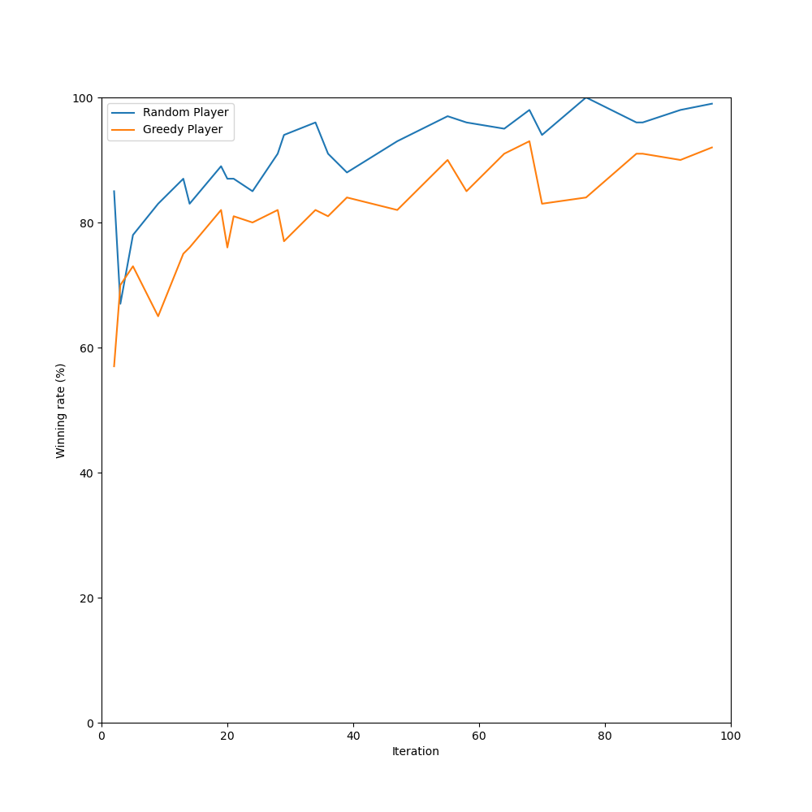

# Maple Reverse AI

Modify Othello AI from https://github.com/suragnair/alpha-zero-general for Maple Reverse

Only difference is 5 random holes on the board that cannot put anything. And also corresponding logic was added.

Below figure is a performance of the model against a random and a greedy player.

Winning rate is calculated using iteration checkpoint after the training.

